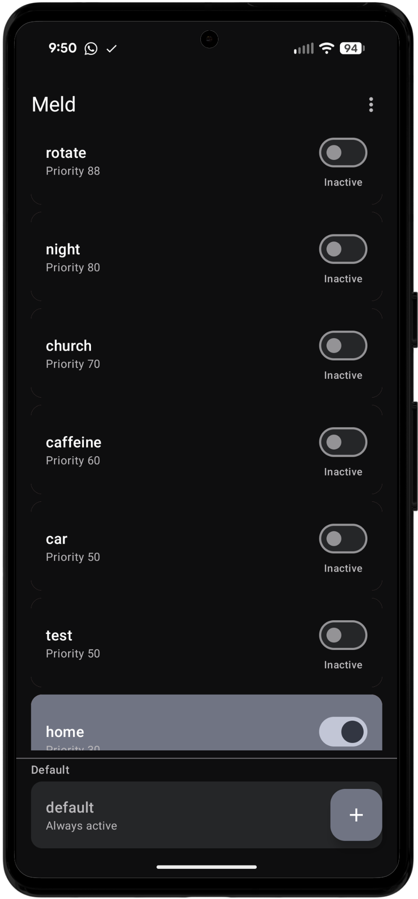
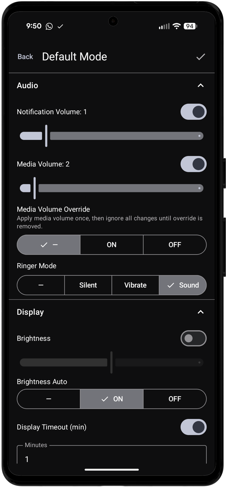
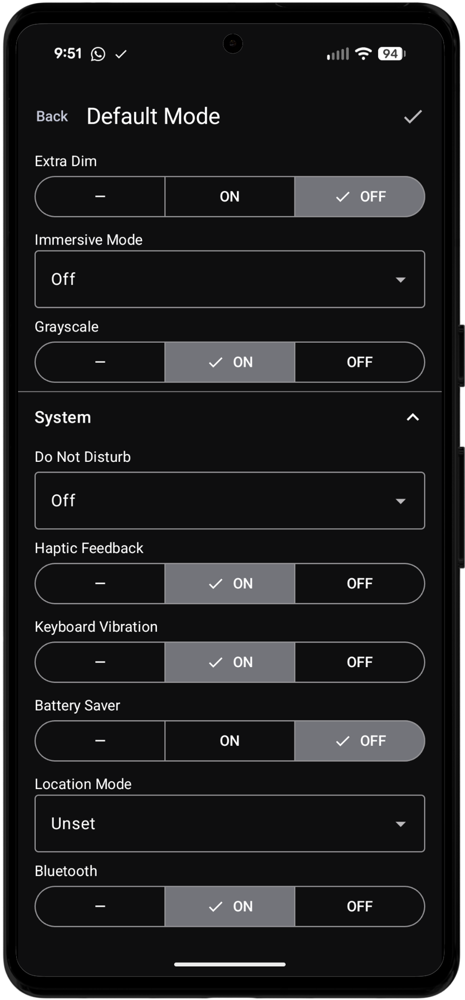
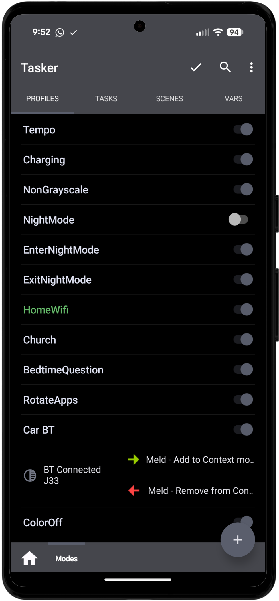

# Meld

Android mode manager for automation tools. Define named collections of device settings ("modes") and activate or deactivate them individually — Meld resolves conflicts and always applies the correct combined settings.

<p align="center">
  
  
  
  
</p>

[Download from Releases](https://codeberg.org/jhot/meld/releases)

Requires Android 12 (API 31) or later.

---

## What is Meld

Meld lets you define **modes** — named collections of device settings like volume, brightness, DND, dark mode, screen rotation, and more. You activate and deactivate modes individually; Meld figures out what settings to apply based on which modes are currently active and their priority order.

For example, you might have a **Focus** mode (DND on, low brightness) and a **Night** mode (dark mode, extra dim). Activating both at once works correctly — Meld resolves any setting conflicts by priority and applies the right combination. Deactivating one mode snaps the remaining mode's settings back into effect automatically.

## Exclusivity Groups

Some modes shouldn't take effect at the same time — for example, you only ever want one of **Home**, **Work**, or **Away** active at once, even if your automations briefly overlap them. Exclusivity groups handle this.

- A mode can belong to zero or more exclusivity groups. A mode in no groups always merges its settings in when active.
- Within a group, only the highest-priority active member applies its settings; other active members of that group are excluded until the winner is deactivated.
- A mode in multiple groups is included as long as it wins at least one of them.

Create, rename, and delete groups inline from the **Exclusivity Groups** section of the Mode Editor — there's no separate management screen. Toggle the chip for a mode's membership; long-press a chip to rename or delete that group everywhere. The mode list shows each mode's group chips for reference.

If you're importing an export from an older version of Meld that used the old "Exclusive"/"Shared" toggle, you'll be prompted to assign each former-Exclusive mode to a group during import (former-Shared modes import with no groups automatically, no prompt needed). Upgrading the app in place (rather than importing an export) migrates this automatically: all former-Exclusive modes are placed into one auto-created "Exclusive" group, preserving behavior.

## Why Meld Instead of Just Tasker

Tasker profiles activate settings but don't track state. If a Sleep profile sets volume to 0 and a Focus profile also sets volume to 0, deactivating Sleep would normally need a separate restore action — but how does Tasker know Focus is still active and still wants volume at 0?

Meld solves this by owning the state. It knows which modes are active at all times and always derives the correct settings from that combination. Tasker (or ntfy, or ADB) is your trigger layer; Meld handles the rest.

## Installation

### From Releases

Download the latest APK from [Releases](https://codeberg.org/jhot/meld/releases) and install it.

### Via Obtainium

Add `https://codeberg.org/jhot/meld` as a source in [Obtainium](https://github.com/ImranR98/Obtainium) to receive automatic updates.

## Permissions Setup

Meld needs three permissions to control device settings. Open **Settings** in the app to see which are granted and which are missing.

### WRITE_SETTINGS

Required for: volumes (notification and media), brightness, ringer mode, screen rotation, and display timeout.

1. Tap **Grant** next to Write Settings in the app
2. Enable **Modify system settings** for Meld in the system dialog

### WRITE_NOTIFICATION_POLICY

Required for: Do Not Disturb mode.

1. Tap **Grant** next to Notification Policy in the app
2. Enable **Do Not Disturb access** for Meld

### WRITE_SECURE_SETTINGS

Required for: dark mode, night light, extra dim, immersive mode, grayscale, haptic feedback, battery saver, and location mode.

This permission cannot be granted from a dialog. Use ADB or Shizuku.

**Via ADB:**
```sh
adb shell pm grant me.jhot.meld android.permission.WRITE_SECURE_SETTINGS
```

**Via Shizuku:**
If [Shizuku](https://shizuku.rikka.app/) is running on your device, tap **Grant via Shizuku** in the Settings screen. Shizuku must be set up separately — see its documentation.

### Settings that also require Shizuku

Some settings need Shizuku even after WRITE_SECURE_SETTINGS is granted, because Android restricts direct writes for them:

- **Extra Dim** — requires Shizuku on Android 12+ (the setting is restricted to system apps)
- **Keyboard Vibration** — requires Shizuku on devices where the OEM blocks direct writes
- **Media Volume at maximum** — requires Shizuku to bypass Android's safe media volume limit

If Shizuku is not available, these settings are silently skipped.

## Usage from Tasker

Install [Tasker](https://tasker.joaoapps.com/), then Meld's plugin will appear automatically in the Tasker plugin list.

### Actions

**Add to Context** — activates a mode by name.

**Remove from Context** — deactivates a mode by name.

In Tasker: add an action → Plugin → Meld → select the action → choose a mode name.

### State Condition

**Meld - Mode State** — evaluates to true when a specific mode is currently active. Use this in Tasker profiles as a condition, or in tasks to branch on mode state.

### Events

**Mode Activated** — fires when a specific mode is added to the active context.

**Mode Deactivated** — fires when a specific mode is removed from the active context.

Use events to react in Tasker when Meld changes state — for example, to update a widget, send a notification, or chain further actions.

### Example Profile

Activate Focus mode when headphones connect, deactivate when they disconnect:

- **Profile:** State → Hardware → Headset Plugged → Any
  - **Enter task:** Plugin → Meld → Add to Context → `Focus`
  - **Exit task:** Plugin → Meld → Remove from Context → `Focus`

## Usage with ntfy

Meld listens for broadcasts from the [ntfy](https://ntfy.sh/) Android app. Send a notification from any ntfy client and Meld will activate or deactivate a mode.

### Message format

| Field | Value |
|-------|-------|
| Body | Exact mode name (case-sensitive) |
| Tags | `meld` + one activate or deactivate tag |

**Activate tags:** `add`, `activate`, `active`, `on`, `enable`, `enabled`, `1`, `true`

**Deactivate tags:** `remove`, `deactivate`, `inactive`, `off`, `disable`, `disabled`, `0`, `false`

Messages are ignored if both an activate and deactivate tag are present, or if neither is present alongside `meld`.

### Example

Activate "Focus":
```
Body:  Focus
Tags:  meld,activate
```

Deactivate "Focus":
```
Body:  Focus
Tags:  meld,deactivate
```

The ntfy notification can be sent from any client — the official Android or iOS apps, a self-hosted ntfy server, the [ntfy CLI](https://ntfy.sh/docs/publish/), or any HTTP client posting to `ntfy.sh`.

## Usage via Intent / ADB

Meld accepts broadcast intents from ADB, Macrodroid, or any other app with broadcast permissions.

**Action:** `meld.intent.SET_MODE`

**Extras:**

| Extra | Type | Description |
|-------|------|-------------|
| `mode` | String | Exact mode name (case-sensitive) |
| `active` | Boolean | `true` to activate, `false` to deactivate (default: `true`) |

**ADB examples:**

```sh
# Activate "Focus"
adb shell am broadcast -a meld.intent.SET_MODE --es mode "Focus" --ez active true

# Deactivate "Focus"
adb shell am broadcast -a meld.intent.SET_MODE --es mode "Focus" --ez active false
```

## Building from Source

```sh
git clone https://codeberg.org/jhot/meld.git
cd meld
./gradlew assembleDebug
```

Requires Android Studio or the Android command-line tools. The project targets Android 12+ (minSdk 31, targetSdk 35).
